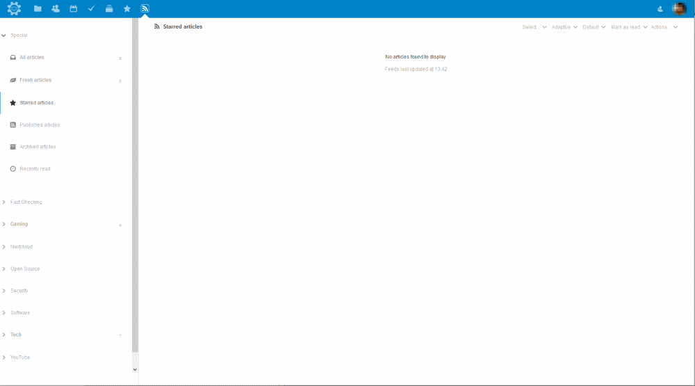

tt-rss-nextcloud-theme
===================
Based off of the [Feedly Theme](https://github.com/levito/tt-rss-feedly-theme)

nextcloud theme for [Tiny Tiny RSS](https://git.tt-rss.org/git/tt-rss/wiki) 1.15 or newer.

For the best experience, use a current browser. IE9 and older versions are not supported.

This theme is tested in Firefox on a regular basis and should work fine in IE10 and recent versions of Safari, Chrome and Opera (15+) as well.

## Installation

**Prerequisites:** Running instance of TT-RSS

Install steps (If you did not find the description on the [TT-RSS Homepage](https://git.tt-rss.org/git/tt-rss/wiki/Themes)):

1. Download the ZIP-File: `wget https://github.com/dugite-code/tt-rss-nextcloud-theme/archive/master.zip`
2. Unzip the ZIP-File: `unzip master.zip`
3. Change into the newly created folder: `cd tt-rss-nextcloud-theme-master`
4. Copy the relevant files into your TT-RSS folder:

    * `cp nextcloud.css [TT-RSS_Home]/themes`
    * `cp -r nextcloud/ [TT-RSS_Home]/themes`

5. Go into your TT-RSS preferences and select the nextcloud-theme.

## Screenshots

News Feed

Licensed under the WTFPL
